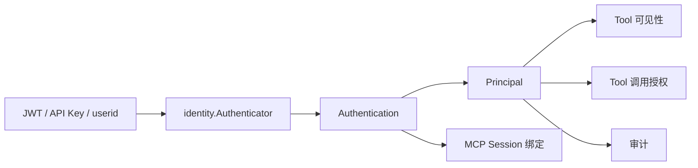
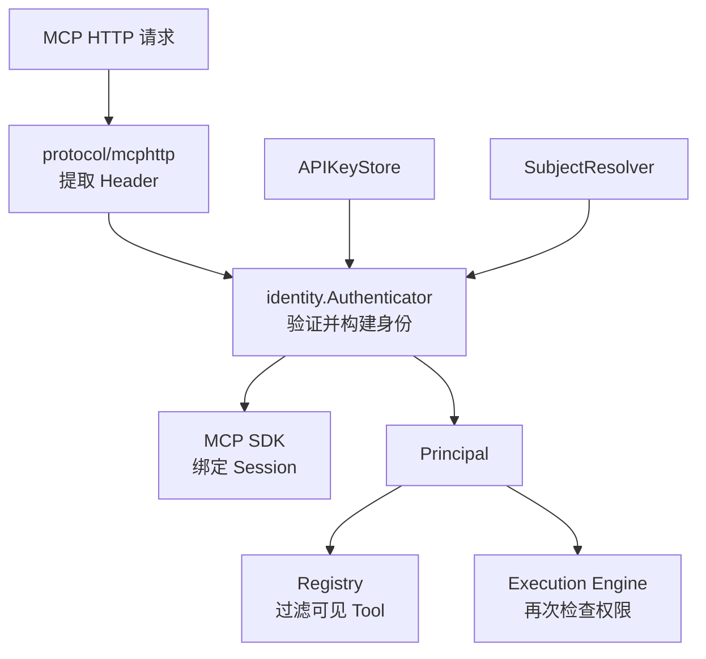
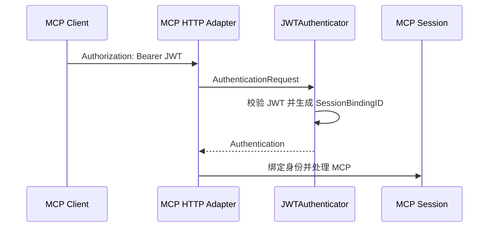
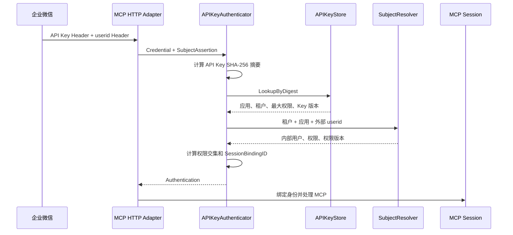
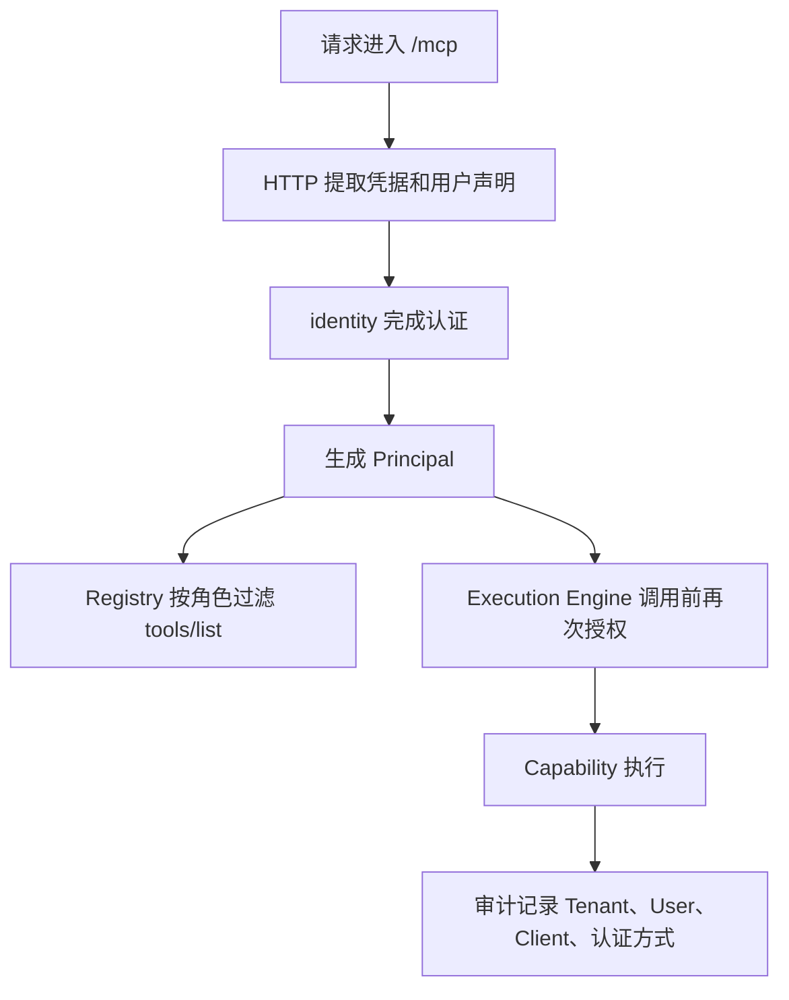

# EACG identity 包架构与认证体系说明

## 1. 文档目的

本文专门解释 EACG `identity` 包的设计逻辑、核心名词和代码实现。

目标读者包括：

- 产品经理；
- 架构师；
- 初级 Go 后端工程师；
- 负责企业 IAM、机器人和 MCP 接入的研发人员。

阅读本文不要求掌握 Go。涉及代码时，会先说明它解决的业务问题。

一句话概括：

> `identity` 包负责把外部请求中的凭据和用户声明，转换成 EACG 内部可信、统一、可授权、可审计的企业身份。

## 2. 先区分四个容易混淆的概念

### 2.1 认证 Authentication

认证回答：

> 这次请求是谁发起的，身份是否可信？

例如：

- JWT 签名是否正确；
- API Key 是否存在、停用或过期；
- 企业微信传入的 userid 能否映射为内部员工。

### 2.2 授权 Authorization

授权回答：

> 已经确认身份后，这个身份可以做什么？

例如：

- 用户是否拥有 `reader` 角色；
- `get_profile` 是否出现在 `tools/list`；
- 用户能否真正执行某个 Tool。

`identity` 负责产生角色和 Scope，但最终的 Tool 授权由 Registry 和 Execution Engine 执行。

### 2.3 凭据 Credential

凭据是请求方用于证明身份的秘密或令牌，例如：

- JWT；
- Service Token；
- API Key。

凭据是敏感数据，不应写入日志、审计或错误响应。

### 2.4 身份 Principal

`Principal` 是认证完成后的 EACG 内部身份。

外部系统可能使用 JWT Claim、企业微信 userid、员工工号等不同格式。进入 EACG 后，都转换成统一的 `Principal`，后续代码不再关心身份来自哪个平台。

## 3. 为什么需要独立的 identity 包

如果每个 Tool 都直接读取 JWT 或 HTTP Header，会产生以下问题：

- 业务代码和认证协议耦合；
- 同一用户在不同入口下使用不同身份格式；
- 容易遗漏过期、停用、租户和权限检查；
- API Key、userid 等敏感信息可能进入日志；
- MCP Session 无法稳定绑定身份；
- 后续接入 OIDC、企业 IAM 时需要修改所有 Tool。

因此 EACG 把认证集中在 `identity` 包：



核心收益是：

- 外部认证方式可以变化；
- 内部身份模型保持稳定；
- Tool 只依赖 `Principal`；
- 认证、授权、会话和审计使用同一身份。

## 4. identity 包的整体架构

当前 `identity` 包分为四部分：

| 文件 | 主要职责 |
| --- | --- |
| [`principal.go`](../identity/principal.go) | 定义统一企业身份和角色检查 |
| [`authentication.go`](../identity/authentication.go) | 定义新认证接口、认证结果和 Session Binding |
| [`apikey.go`](../identity/apikey.go) | 实现 API Key 加实际用户的复合认证 |
| [`jwt.go`](../identity/jwt.go) | 实现 HS256 JWT 校验 |

包外还有两个重要协作者：

- [`app.go`](../app.go)：接收认证配置并组装 EACG 应用；
- [`protocol/mcphttp/handler.go`](../protocol/mcphttp/handler.go)：从 HTTP 请求提取凭据和 userid，并适配 MCP SDK。

边界关系如下：



`identity` 不直接依赖 HTTP 或 MCP SDK，因此将来增加其他传输协议时，可以复用同一套认证模型。

## 5. 核心数据模型

### 5.1 Principal：EACG 眼中的“当前调用者”

代码结构：

```go
type Principal struct {
    TenantID        string
    UserID          string
    AgentID         string
    ClientID        string
    AuthMethod      string
    CredentialID    string
    SubjectProvider string
    Roles           []string
    Scopes          []string
    Attrs           map[string]string
}
```

字段解释：

| 字段 | 产品含义 | 示例 |
| --- | --- | --- |
| `TenantID` | 用户和应用所属企业或租户 | `tenant-a` |
| `UserID` | 企业内部用户唯一标识 | `user-1001` |
| `AgentID` | 发起调用的 Agent，可选 | `assistant-sales` |
| `ClientID` | 调用应用或机器人 | `wecom-bot` |
| `AuthMethod` | 本次认证方式 | `api_key`、`bearer` |
| `CredentialID` | 凭据的安全编号，不是密钥明文 | `wecom-key-01` |
| `SubjectProvider` | 外部用户来源 | `wecom` |
| `Roles` | 用于能力授权的角色 | `reader` |
| `Scopes` | 更细粒度的权限范围 | `profile:read` |
| `Attrs` | 经过信任和白名单控制的扩展属性 | 部门、区域 |

当前 MVP 要求 `TenantID` 和 `UserID` 都不能为空。

这表示 EACG 当前不允许仅使用机器人身份代替实际用户执行能力。这样可以避免所有员工共用一个身份，导致越权和审计失真。

### 5.2 SubjectAssertion：外部系统声称“当前用户是谁”

```go
type SubjectAssertion struct {
    Provider   string
    ExternalID string
}
```

示例：

```text
Provider   = wecom
ExternalID = zhangsan
```

它只是外部身份声明，还不是最终可信的 `Principal`。

`SubjectResolver` 必须进一步把它映射为企业内部用户。

### 5.3 AuthenticationRequest：认证输入

```go
type AuthenticationRequest struct {
    Credential string
    Subject    *SubjectAssertion
}
```

它包含两类信息：

- `Credential`：证明应用或用户身份的凭据；
- `Subject`：外部系统提供的实际用户声明。

JWT 模式通常只需要 `Credential`。API Key 复合认证同时需要两者。

### 5.4 Authentication：认证输出

```go
type Authentication struct {
    Principal        Principal
    CredentialID     string
    SessionBindingID string
    ExpiresAt        time.Time
}
```

字段解释：

| 字段 | 作用 |
| --- | --- |
| `Principal` | 交给授权、Tool 和审计使用的统一身份 |
| `CredentialID` | 标识本次使用的凭据记录 |
| `SessionBindingID` | 把 MCP Session 绑定到身份和权限 |
| `ExpiresAt` | 本次认证结果的有效期 |

`Authentication.Valid` 会检查：

- Principal 是否包含租户和用户；
- Credential ID 是否存在；
- Session Binding ID 是否存在；
- 有效期是否存在且尚未过期。

只有完整认证结果才能进入 MCP Server。

### 5.5 Authenticator：统一认证入口

```go
type Authenticator interface {
    Authenticate(
        context.Context,
        AuthenticationRequest,
    ) (Authentication, error)
}
```

这是 `identity` 包最重要的接口。

无论底层使用 JWT、API Key、OIDC 还是企业内部 Token 服务，对 EACG 上层都表现为同一个 `Authenticate` 方法。

## 6. 两种认证模式

### 6.1 JWT 模式

JWT 自身可以携带：

- Tenant ID；
- User ID；
- Client ID；
- Agent ID；
- Roles；
- Scopes；
- 过期时间。

处理流程：



`JWTAuthenticator` 当前检查：

- 签名算法必须是 HS256；
- 签名正确；
- Issuer 正确；
- Audience 正确；
- Token 包含过期时间且没有过期；
- `tenant_id` 和 `sub` 存在。

JWT 直接实现统一的 `Authenticator` 接口，不再保留旧式 Verifier 或兼容适配层。

### 6.2 API Key 加 userid 模式

固定 API Key 一般属于机器人或应用，而不是某一位员工。

因此 EACG 使用两段式身份：

```text
API Key   → 证明哪个应用正在调用
userid    → 表示当前是哪位用户发起调用
```

处理流程：



这个流程同时回答两个问题：

- 哪个应用在访问 EACG？
- 这个应用当前代表哪位员工操作？

缺少任何一部分都会认证失败。

## 7. API Key 认证的代码设计

### 7.1 APIKeyRecord：应用凭据记录

`APIKeyRecord` 保存：

- `CredentialID`：凭据编号；
- `TenantID`：所属租户；
- `ClientID`：调用应用；
- `AgentID`：可选 Agent；
- `Digest`：API Key 的 SHA-256 摘要；
- `SubjectProvider`：允许的用户来源；
- `AllowedRoles`：该应用最多可使用的角色；
- `AllowedScopes`：该应用最多可使用的 Scope；
- `Version`：Key 或配置版本；
- `Disabled`：是否停用；
- `ExpiresAt`：可选过期时间。

原始 API Key 不保存在记录中。

`DigestAPIKey` 先把请求中的 API Key 转成固定长度摘要，再查询 Store：

```text
原始 API Key → SHA-256 → [32]byte 摘要 → APIKeyStore
```

SHA-256 适用于高熵、随机生成的 API Key。它不适合保护用户自定义的弱密码，因此生产 API Key 必须由安全随机数生成器产生，并具有足够长度。

### 7.2 APIKeyStore：凭据数据来源

```go
type APIKeyStore interface {
    LookupByDigest(context.Context, [32]byte) (APIKeyRecord, error)
}
```

产品上可以把它理解为：

> 根据请求中的密钥，查询它属于哪个企业应用，以及这个应用最多拥有哪些权限。

当前提供 `MemoryAPIKeyStore`，只适合：

- 本地演示；
- 单元测试；
- 概念验证。

生产环境应实现数据库、配置中心或密钥管理系统版本。

### 7.3 SubjectResolver：用户目录适配器

```go
type SubjectResolver interface {
    Resolve(
        context.Context,
        SubjectResolveRequest,
    ) (Subject, error)
}
```

产品上可以把它理解为：

> 把企业微信等外部平台的 userid，转换成企业内部员工身份和权限。

输入包括：

- Tenant ID；
- Client ID；
- Agent ID；
- Provider；
- External ID。

输出 `Subject` 包含：

- 内部 User ID；
- Roles；
- Scopes；
- 扩展属性；
- 权限版本；
- 停用状态。

EACG 核心不连接具体企业组织架构。不同企业通过实现 `SubjectResolver` 接入自己的 IAM、员工目录或 RBAC 服务。

## 8. 为什么权限必须取交集

API Key 的权限代表“应用最多能做什么”，用户权限代表“员工本人能做什么”。

最终权限必须同时满足两者：

```text
最终权限 = 应用最大权限 ∩ 用户实际权限
```

示例一：

```text
应用角色：[reader]
用户角色：[reader, admin]
最终角色：[reader]
```

用户是管理员，也不能让只读机器人获得管理能力。

示例二：

```text
应用角色：[reader, admin]
用户角色：[reader]
最终角色：[reader]
```

机器人配置了管理能力，也不能绕过用户本人的权限。

示例三：

```text
应用角色：[]
用户角色：[reader]
最终角色：[]
```

空权限表示不授予权限，不表示“允许全部”。

## 9. SessionBindingID 是什么

### 9.1 它不是 MCP Session ID

两者作用不同：

| 名称 | 作用 |
| --- | --- |
| `Mcp-Session-Id` | 标识一段 MCP 协议会话 |
| `SessionBindingID` | 标识这段会话允许由哪个安全身份继续使用 |

可以类比为：

```text
Mcp-Session-Id  = 房间号
SessionBindingID = 房间登记人的身份指纹
```

只有房间号，没有正确身份，不能继续使用房间。

### 9.2 如何生成

API Key 模式使用以下字段：

- Tenant ID；
- Client ID；
- Agent ID；
- User ID；
- Credential ID；
- Credential Version；
- Permission Version；
- 最终 Roles；
- 最终 Scopes。

Roles 和 Scopes 会先去重、排序，再序列化并计算 SHA-256。

最终得到不可逆的十六进制标识，不包含 API Key 明文。

### 9.3 为什么包含版本和权限

假设用户权限从 `reader` 变成无权限：

- 新请求重新认证；
- 新权限生成新的 Session Binding ID；
- 新 ID 与 Session 初始化时保存的旧 ID 不一致；
- MCP SDK 返回 `403 session user mismatch`；
- Client 必须重新初始化 Session。

同理，更换用户、API Key 或 Key 版本也不能继续复用旧 Session。

轮换 API Key 时，业务系统必须同步更新 `APIKeyRecord.Version`，确保旧 Session Binding 失效。

## 10. 有效期和认证租约

### JWT

JWT 的 `exp` 决定认证结果过期时间。

### API Key

固定 API Key 可能没有天然过期时间，但 MCP SDK 要求认证结果包含有效期。

因此 API Key 认证器使用“认证租约”：

```text
默认认证租约 = 当前时间 + 5 分钟
```

如果 API Key 本身更早过期，则使用更早的时间：

```text
认证结果过期时间 = min(当前时间 + 租约, API Key 过期时间)
```

认证租约不是缓存时间。当前实现会在每个 MCP HTTP 请求上重新查询 API Key 和用户身份。

租约的作用是给本次认证结果一个明确的生命周期，并满足 MCP SDK 的安全要求。

## 11. HTTP 和 identity 的职责边界

`identity` 包不读取 HTTP Header。

HTTP 相关工作由 `protocol/mcphttp` 负责：

- 从 `Authorization` 读取 Bearer Token；
- 从自定义 Header 读取 API Key；
- 从配置的 Header 读取 requester userid；
- 检查重复、冲突和非法 Header；
- 把 HTTP 输入转换成 `AuthenticationRequest`；
- 把 `Authentication` 转换成 MCP SDK `TokenInfo`。

自定义 API Key Header 会在请求副本中转换为 SDK 能理解的 Bearer Header。这个转换只是协议适配，不会改变 API Key 的业务含义。

这样可以保证：

- `identity` 不依赖 HTTP；
- 业务身份模型不依赖 MCP SDK；
- 升级 MCP SDK 时主要修改协议适配层；
- 将来其他传输协议可以复用 `Authenticator`。

## 12. 错误模型

identity 包定义以下主要错误：

| 错误 | 内部含义 |
| --- | --- |
| `ErrUnauthenticated` | 对外统一的身份认证失败 |
| `ErrAPIKeyNotFound` | Store 中不存在 API Key |
| `ErrSubjectNotFound` | 用户目录中不存在该用户 |

对外不会区分“Key 不存在”“用户不存在”或“用户已停用”，这些情况统一返回 `401`，避免攻击者探测内部账号和密钥状态。

错误映射：

| HTTP 状态 | 场景 |
| --- | --- |
| `401` | 缺少凭据、凭据无效、userid 无效、用户停用 |
| `403` | 当前认证身份与已有 MCP Session 不一致 |
| `404` | MCP Session 不存在或已经过期 |
| `500` | API Key Store、IAM 或用户目录异常 |

认证失败日志只记录：

- Request ID；
- 稳定错误码；
- 凭据来源类型。

不会记录：

- API Key；
- JWT；
- 完整 userid；
- 请求正文；
- 认证后端内部错误。

## 13. 企业微信 Header 的信任边界

requester userid Header 表示：

> 上游系统声称本次操作用户是这个 userid。

它不是用户密码，也不是天然具有防伪能力的签名。

生产环境必须保证：

- 使用 HTTPS；
- 公网入口删除客户端自行传入的同名 Header；
- 只允许企业微信可信链路或企业网关注入 userid；
- API Key 只保存在企业微信和密钥管理系统；
- 条件允许时增加 mTLS、来源 IP 限制或请求签名。

如果攻击者同时掌握 API Key，并且可以任意伪造 userid Header，当前模式无法证明真实用户身份。

这是接入架构的信任前提，不是 Session ID 能解决的问题。

## 14. 认证、授权与审计如何协作

完整链路：



为什么需要两次权限检查：

1. `tools/list` 隐藏用户无权看到的 Tool；
2. `tools/call` 再检查一次，防止客户端猜测 Tool 名称直接调用。

认证成功不等于有权调用所有 Tool。

## 15. 如何扩展新的认证方式

例如未来接入企业 OIDC：

1. 实现一个新的 `Authenticator`；
2. 校验 OIDC Token；
3. 映射成 `Principal`；
4. 生成稳定的 `SessionBindingID`；
5. 返回明确的 `ExpiresAt`；
6. 使用 `eacg.New` 注入应用。

新的认证器必须遵守：

- 不把原始凭据放入 Principal；
- 不把外部可伪造字段直接当作 Tenant ID；
- 必须提供内部 User ID；
- 权限变化应使 Session Binding 变化；
- 返回的切片和 map 不应与外部共享可修改状态；
- 认证失败不能泄露内部原因。

## 16. 推荐代码阅读顺序

开发人员可以按以下顺序阅读：

1. [`identity/principal.go`](../identity/principal.go)：理解统一身份；
2. [`identity/authentication.go`](../identity/authentication.go)：理解认证输入、输出和 Session Binding；
3. [`identity/apikey.go`](../identity/apikey.go)：理解复合身份和权限交集；
4. [`identity/jwt.go`](../identity/jwt.go)：理解兼容 JWT 流程；
5. [`protocol/mcphttp/handler.go`](../protocol/mcphttp/handler.go)：理解 HTTP 与 MCP 适配；
6. [`cmd/eacg-example/main.go`](../cmd/eacg-example/main.go)：查看完整组装示例。

对应测试：

- [`identity/apikey_test.go`](../identity/apikey_test.go)；
- [`identity/jwt_test.go`](../identity/jwt_test.go)；
- [`protocol/mcphttp/handler_test.go`](../protocol/mcphttp/handler_test.go)；
- [`app_test.go`](../app_test.go)。

## 17. 当前实现边界

当前已经支持：

- HS256 JWT；
- 固定 API Key；
- 外部 userid 到内部用户映射；
- 应用权限与用户权限取交集；
- API Key 停用和过期；
- 用户停用；
- Session 身份和权限绑定；
- 内存 API Key Store；
- 单一 `Authenticator` 公开认证接口。

当前不包含：

- API Key 生成和派发管理后台；
- 数据库版 API Key Store；
- 企业 IAM 或组织目录的具体实现；
- OAuth/OIDC 完整授权流程；
- mTLS 和请求签名；
- 服务身份直接调用 Tool；
- R2/R3 高风险写操作和人工确认。

这些能力应通过接口扩展，不应把具体企业平台逻辑写入 `identity` 核心。

## 18. 产品经理常见问题

### API Key 是不是用户身份？

不是。固定 API Key 通常代表机器人或应用。实际用户由可信 userid 和企业用户目录共同确定。

### 有 Token 为什么还需要 Session ID？

Token 或 API Key 负责认证，Session ID 负责标识 MCP 协议会话。两者解决的问题不同。

### 为什么 Session 还要绑定用户？

防止一个用户拿到另一个用户的 Session ID 后继续操作，也防止同一 Session 中悄悄切换用户或权限。

### 为什么不能只相信企业微信传来的 userid？

userid 通常不是秘密。必须同时验证调用应用，并确保 userid Header 来自可信链路。

### 为什么权限不是用户权限直接决定？

机器人本身也应该有能力边界。最终权限取应用和用户的交集，可以避免任何一方单独扩大权限。

### 为什么 API Key 不直接存明文？

服务只需要判断请求中的 Key 是否匹配，不需要再次展示原始 Key。保存摘要可以降低存储泄露后的风险。

### 用户权限变化后会立即生效吗？

API Key 模式下，每个 HTTP 请求都会重新认证。只要 `SubjectResolver` 返回新的权限或 `PermissionVersion`，旧 Session 就不能继续使用，需要重新初始化。

JWT 模式的权限来自 JWT Claim，需要由认证系统签发包含新权限的 Token；旧 Token 在过期或被外部认证系统撤销前，仍可能保留旧权限。

### 当前方案是否等同于完整的用户单点登录？

不等同。API Key 加可信 userid 是企业系统间的复合身份模式。若需要用户主动登录、授权同意、Token 刷新和撤销，应接入 OAuth/OIDC。

## 19. 最后用一句业务语言总结

EACG 的认证体系不是简单判断“密钥对不对”，而是依次确认：

```text
哪个企业
→ 哪个应用
→ 代表哪个用户
→ 双方共同拥有什么权限
→ 当前 MCP Session 是否仍属于同一身份
```

最终得到的 `Principal` 是 EACG 内部所有 Tool 可见性、调用授权和审计的统一依据。
