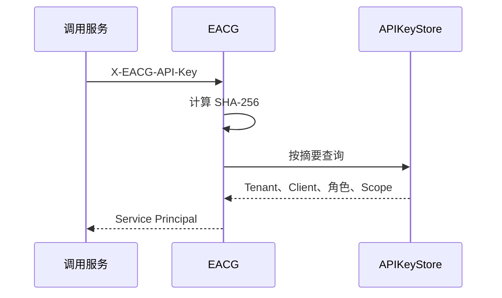

# EACG identity 包架构与认证体系

## 1. identity 解决什么问题

identity 包把不同凭据转换为统一调用者身份：

```text
JWT     → 用户 Principal
API Key → 服务 Principal
自定义认证器 → 用户或服务 Principal
```

协议层只认识 `Authenticator`，业务能力只认识 `Principal`。因此 Tool 不需要理解 JWT、API Key、企业微信 Header 或用户目录。

## 2. 核心名词

| 名词 | 含义 |
| --- | --- |
| Credential | JWT、API Key 等调用凭据 |
| Subject Assertion | 业务系统可选传入的外部用户声明 |
| Authenticator | 校验凭据并生成统一身份 |
| Principal | 当前请求中经过认证的调用者 |
| SubjectType | 调用者类型，取值为 `user` 或 `service` |
| Client | 调用 MCP 的应用或服务 |
| User | 实际操作用户 |
| Role / Scope | 调用者拥有的权限 |

## 3. 统一认证接口

```go
type AuthenticationRequest struct {
    Credential string
    Subject    *SubjectAssertion
}

type Authentication struct {
    Principal Principal
    ExpiresAt time.Time
}

type Authenticator interface {
    Authenticate(context.Context, AuthenticationRequest) (Authentication, error)
}
```

`Subject` 是可选扩展。只有业务显式配置 `SubjectHeader` 时，HTTP 层才读取该声明。内置 API Key 认证器不会使用它。

## 4. 用户身份与服务身份

```go
type Principal struct {
    SubjectType SubjectType
    TenantID    string
    UserID      string
    ClientID    string
    AgentID     string

    AuthMethod      string
    CredentialID    string
    SubjectProvider string
    Roles           []string
    Scopes          []string
    Attrs           map[string]string
}
```

有效性规则：

- 两类身份都必须有 `TenantID`；
- `user` 必须有 `UserID`；
- `service` 必须有 `ClientID`，可以没有 `UserID`；
- `AuthMethod` 和 `CredentialID` 用于认证结果校验与审计。

服务身份不是“虚拟用户”。审计记录 ClientID 和 CredentialID，不伪造 UserID。

## 5. 内置 API Key 服务认证



`APIKeyRecord` 保存：

- CredentialID、TenantID、ClientID 和可选 AgentID；
- Key 的 SHA-256 摘要；
- 服务 Roles、Scopes；
- 停用状态和可选过期时间。

内置认证器不要求 userid、不访问用户目录，也不做用户权限交集。权限列表为空表示不授予权限。认证租约默认五分钟，并与 Key 过期时间取较早值。

API Key 的生成、明文保存、派发、轮换和吊销由企业密钥系统负责，EACG 不提供管理接口。

## 6. JWT 用户认证

JWT 认证器校验 HS256、issuer、audience 和过期时间，再把 JWT `sub` 映射为 `SubjectUser` 的 UserID。生产系统可以自行实现 JWKS、OIDC 或企业 IAM Authenticator。

## 7. 代理用户认证由业务实现

企业微信场景同时存在应用和用户：

```text
API Key → 企业微信机器人
requester userid → 实际操作用户
```

业务项目应实现自定义 `Authenticator`：

1. 校验 API Key 并读取应用身份；
2. 从可选 `SubjectAssertion` 读取外部 userid；
3. 调用企业用户目录；
4. 完成用户状态、租户和权限检查；
5. 返回 `SubjectUser` Principal。

EACG 只提供可配置的 `SubjectHeader` 和 `SubjectProvider` 传递入口，不包含企业微信专用 Resolver 或 Header 名称。

## 8. Capability 身份要求

Capability 可以声明：

```go
IdentityAny
IdentityUser
IdentityService
```

- 空值自动规范化为 `IdentityAny`；
- Registry 按身份类型和角色裁剪 Tool；
- Execution Engine 调用前再次校验，防止绕过列表；
- 涉及个人数据或真实操作人的 Tool 应使用 `IdentityUser`；
- 后台任务专用 Tool 可以使用 `IdentityService`。

## 9. 无状态与安全边界

每一条 MCP POST 都重新读取 Credential、调用 Authenticator、检查租约并生成 Principal。Key 吊销和权限变化在下一次请求生效，多实例不需要共享认证会话。

安全要求：

- 数据库只按摘要查询 API Key；
- Query 参数不能传递凭据；
- 自定义 Key Header 与 Authorization 同时出现时拒绝；
- Subject Header 只有业务明确配置后才生效；
- requester userid 必须来自可信网关，不能仅凭客户端自报；
- Tool 参数不能覆盖 Principal；
- 日志和审计不记录明文凭据。

## 10. 给产品经理的简化理解

```text
API Key：哪个系统在调用？
JWT：哪个用户在调用？
SubjectType：本次调用属于服务还是用户？
IdentityRequirement：这个 Tool 允许哪类调用者？
```

如果机器人需要代表张三执行操作，业务系统负责证明“这个人确实是张三”；EACG 负责把确认后的身份用于 Tool 展示、授权和审计。
