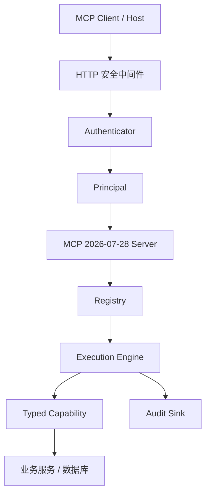
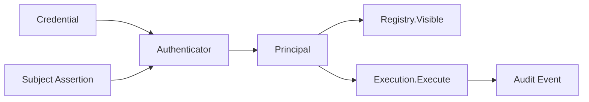

# EACG v0.2.0 技术架构与设计

## 1. 设计目标

EACG 是企业 MCP Tool 网关，负责把业务能力安全地开放给 Agent。当前版本只支持 MCP `2026-07-28`、HTTP 和 R0/R1 只读能力。

设计原则：

- 无状态；
- 接口隔离；
- 依赖注入；
- 最小权限；
- Tool 列表裁剪与执行授权双重防护；
- 业务身份不由 Tool 参数决定。

## 2. 架构



核心包职责：

| 包 | 主要职责 | 不负责 |
| --- | --- | --- |
| `eacg` | 应用组装、HTTP 生命周期和健康检查 | 业务查询 |
| `protocol/mcphttp` | 新版协议、Header、安全中间件和 Tool 适配 | 企业用户数据 |
| `identity` | JWT/API Key 认证和 Principal | Tool 执行 |
| `registry` | Tool 注册、冻结、排序和可见性 | 最终授权 |
| `execution` | 二次授权、超时、输出保护和审计 | HTTP 解析 |
| `capability` | 类型化业务能力和 Schema 校验 | 认证方式 |
| `connector/httpconnector` | 固定下游 HTTP 调用和 SSRF 防护 | 任意 URL 代理 |

应用创建 Handler 后 Registry 会被冻结。这样所有实例在运行期都使用稳定、确定的 Tool 集合。

## 3. HTTP 和协议

`/mcp` 只接受 POST。请求必须携带：

- `Mcp-Protocol-Version: 2026-07-28`；
- `Mcp-Method`；
- Tool 调用额外携带 `Mcp-Name`；
- JSON-RPC `_meta` 中的版本、Client Capabilities 和 Client Info；
- 当前请求的认证信息。

普通响应为 JSON。SDK 自动提供 `server/discover`、Server Info、`resultType` 和 Header/Body 一致性校验。

Handler 使用：

```go
mcp.StreamableHTTPOptions{
    Stateless:                    true,
    JSONResponse:                 true,
    MaxRequestBodyBytes:          limit,
    PropagateRequestCancellation: true,
}
```

实际中间件顺序：

```text
requestContextMiddleware
  → http.CrossOriginProtection
  → API Key Header 到内部 Bearer 的安全桥接
  → SDK Bearer Token 校验
  → protocolMiddleware
  → SDK Streamable HTTP Handler
```

这个顺序保证：

- 所有错误响应都带 Request ID；
- 浏览器跨域请求先被拦截；
- 认证失败不会进入协议和 Tool 层；
- 自定义 API Key 不会暴露给 SDK 日志；
- 只有认证成功的调用方才能获得协议发现信息。

协议中间件固定拒绝非 POST、非 `2026-07-28` 请求、缺失方法 Header、旧状态 Header 和已经删除的方法。SDK 继续负责 JSON-RPC 解析、请求元数据校验以及 Header/Body 一致性。

`server/discover` 只返回：

```json
{
  "supportedVersions": ["2026-07-28"],
  "capabilities": {
    "tools": {
      "listChanged": false
    }
  },
  "cacheScope": "public",
  "ttlMs": 0
}
```

## 4. 认证和授权

认证返回当前请求的 Principal，不产生服务器端协议状态。JWT 默认生成用户身份，内置 API Key 认证器只生成服务身份，不要求 userid。



`Authentication` 只包含 Principal 和 ExpiresAt。CredentialID 位于 Principal 中，避免同一信息出现两份并产生不一致。

Principal 使用 `SubjectType` 区分 `user` 和 `service`。代理用户场景由业务自定义 Authenticator 解析可选 Subject Assertion。

授权有两层：

1. Registry 只列出当前身份类型和角色可见的 Tool；
2. Execution Engine 调用前重新检查身份类型和角色。

`tools/list` 设置 `cacheScope=private` 和 `ttlMs=0`，避免不同用户共享缓存。

## 5. Capability

Capability 由 Descriptor 和类型化 Handler 组成：

- Descriptor 描述名称、版本、风险、身份要求、角色和输出白名单；
- Go 结构体生成输入输出 JSON Schema；
- Execute 负责反序列化、Schema 校验和调用 Handler；
- Execution Engine 负责超时、授权、输出保护和审计。

MVP 只允许 R0/R1、只读能力。业务查询必须使用参数化语句或固定下游接口，不开放任意 SQL 和任意 URL。

## 6. 多实例

所有请求包含完整协议上下文和认证信息。任何实例都可以处理任意请求：

```text
discover → 实例 A
tools/list → 实例 B
tools/call → 实例 C
```

Registry 在启动后冻结，各实例必须加载相同能力版本。用户目录和 Key Store 是业务侧共享事实来源。

### example 的组装方式

`cmd/eacg-example` 已更新为 `v0.2.0`，用于展示完整接入：

```text
环境变量
  → JWT 或 API Key Authenticator
  → HTTP Connector
  → get_profile Capability
  → eacg.New
  → RegisterCapability
  → App.Run
```

JWT 是默认模式；`make run-api-key` 展示不需要 userid 的 API Key 服务身份认证。内存 Key Store 只用于本地学习，生产系统必须替换为企业数据库或密钥服务。企业微信代理用户认证由业务项目自定义 Authenticator。

## 7. 公开接口变化

相对 `v0.1.0`，业务接入方需要完成以下编译期调整：

- 从 `eacg.Config` 删除 SessionTimeout 配置；
- 可通过 `MaxRequestBodyBytes` 设置 MCP 请求体上限；
- 自定义 Authenticator 返回的 Principal 必须包含 AuthMethod 和 CredentialID；
- Principal 必须声明 SubjectType；用户提供 UserID，服务提供 ClientID；
- Authentication 不再包含重复的 CredentialID；
- APIKeyRecord 直接保存服务 Roles 和 Scopes；
- 内置 API Key 认证器不再包含 SubjectResolver；
- Capability 可以通过 IdentityRequirement 限制用户或服务身份。

Capability、Registry、Execution、Audit 和 HTTPAuthenticationConfig 的使用方式保持不变。

## 8. 安全

- 请求体默认不超过 4 MiB；
- 输出不超过 1 MiB；
- Header 长度和控制字符校验；
- Origin 和 DNS rebinding 防护；
- HTTP Connector Host 白名单；
- 敏感字段递归遮盖；
- 对外错误隐藏内部细节；
- 审计记录 Tenant、User、Client、Agent、Credential 和 Capability。

安全日志和 MCP Tool Error 使用两套信息：

- 安全日志保留 Request ID 和稳定错误码，便于内部排查；
- MCP Client 只看到通用错误，不获得数据库、密钥或下游正文。

## 9. 测试架构

测试分为四层：

1. identity 单元测试验证用户/服务身份、凭据、过期、权限和后端错误；
2. protocol 测试验证 HTTP Header、协议版本、缓存字段和错误码；
3. App 集成测试使用官方 SDK 完成发现、列表和调用；
4. 分布式测试让相邻请求轮流进入两个 Handler，证明没有共享协议状态。

请求取消测试会让 Capability 等待 Context，取消客户端请求后必须立即收到 `ctx.Done()`。

## 10. 非目标

`v0.2.0` 不实现 RPC、STDIO、Tasks、MRTR、Prompt、Resource、写能力、Kubernetes 和完整可观测性平台。

## 11. 教学客户端

`cmd/eacg-client` 是独立教学命令，不参与 Server 依赖组装：

```text
Flag / 环境变量
  → strictTransport
  → 官方 MCP Client
  → Streamable HTTP
  → EACG Server
```

客户端显式声明空 Capabilities，关闭 MRTR，并在网络层阻止旧协议回退。它支持 JWT/API Key、分步 Action 和脱敏 trace，用于理解协议及业务联调。
