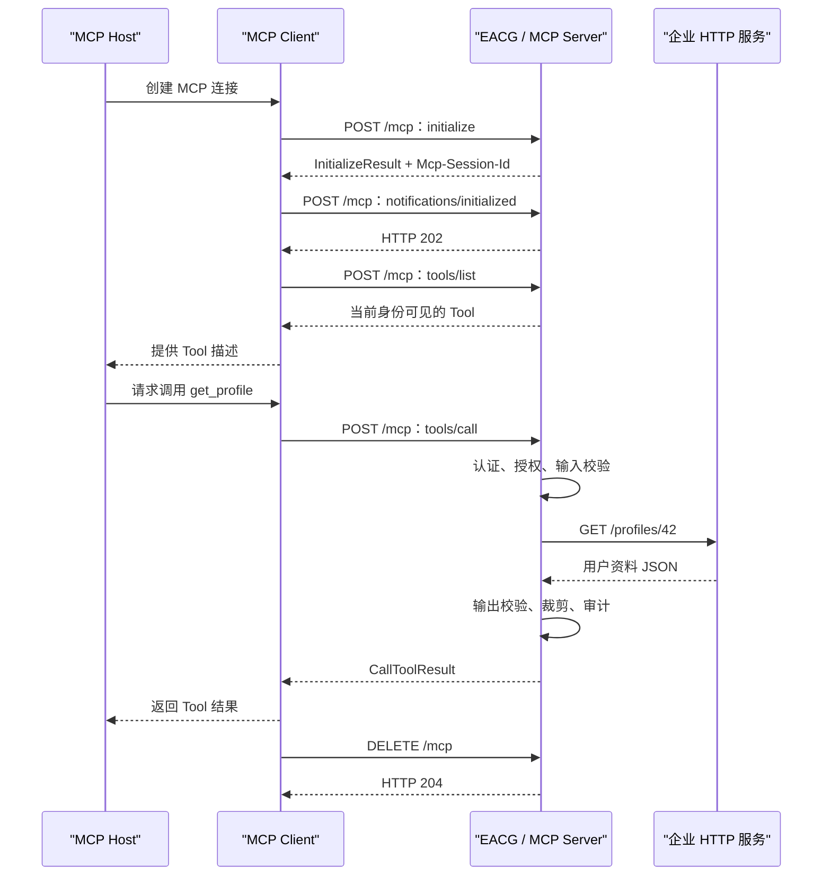

# MCP 协议工作流程入门

> 面向只有 HTTP 开发经验的后端工程师

- 适用项目：EACG
- 主要传输方式：MCP Streamable HTTP
- 示例协议版本：`2025-11-25`
- 阅读目标：理解 MCP 如何建立会话、发现 Tool、调用 Tool、接收结果并关闭会话

---

## 1. 先用一句话理解 MCP

MCP（Model Context Protocol）是一套让 AI 应用发现和调用外部能力的应用层协议。

可以先把它理解为：

```text
JSON-RPC
   +
能力协商
   +
Tool / Resource / Prompt 等标准对象
   +
HTTP、SSE 或 STDIO 等传输方式
```

如果开发者已经熟悉 HTTP，可以把 MCP Server 暂时理解成一种特殊的 HTTP 服务：

- 它通常只提供一个 `/mcp` 端点；
- 请求 Body 使用 JSON-RPC；
- 客户端连接后要先完成初始化；
- 初始化后才能查询和调用 Tool；
- 一个 MCP Session 可以包含多次 HTTP 请求；
- 服务端可以使用 SSE 主动发送消息。

---

## 2. MCP 在协议栈中的位置

MCP 不是 TCP、HTTP 的替代品。

它位于 HTTP 之上：

```text
┌─────────────────────────────────────┐
│  MCP：Tool、Resource、Prompt、Session │
├─────────────────────────────────────┤
│  JSON-RPC：请求、响应、通知、错误      │
├─────────────────────────────────────┤
│  HTTP / SSE：消息传输                 │
├─────────────────────────────────────┤
│  TLS / TCP：安全连接和字节传输         │
└─────────────────────────────────────┘
```

各层职责：

| 层级 | 主要职责 |
| --- | --- |
| TCP | 建立可靠连接、传输字节 |
| TLS | 加密、服务端证书、可选客户端证书 |
| HTTP | 路由、Header、状态码、请求和响应 |
| SSE | 在一个 HTTP Response 中持续发送事件 |
| JSON-RPC | 定义请求 ID、方法、参数、结果和错误 |
| MCP | 定义初始化、Tool、Resource、Prompt 等语义 |

因此，一次 MCP 调用可能同时经历：

```text
TCP 建连
→ TLS 握手
→ HTTP 请求
→ JSON-RPC 解析
→ MCP 方法处理
→ HTTP/SSE 响应
```

---

## 3. 参与者

MCP 流程中主要有三个角色：

### 3.1 MCP Host

Host 是用户直接使用的 AI 应用，例如编码助手、企业 Agent 或工作流系统。

Host 负责：

- 管理用户交互；
- 调用大语言模型；
- 决定连接哪些 MCP Server；
- 把 Tool 描述提供给模型；
- 根据模型计划发起 Tool 调用；
- 把 Tool 结果交回模型。

### 3.2 MCP Client

Client 通常是 Host 内部的 MCP 协议组件。

Client 负责：

- 连接 MCP Server；
- 发送 `initialize`；
- 保存 Session ID；
- 查询 Tool；
- 调用 Tool；
- 接收通知；
- 关闭 Session。

Host 和 Client 经常运行在同一个程序中，但概念上是两个职责。

### 3.3 MCP Server

Server 对外提供 Tool、Resource、Prompt 等能力。

在 EACG 中：

```text
EACG = MCP Server + 企业能力治理 + HTTP 下游调用
```

---

## 4. TCP 三次握手与 MCP 初始化的类比

TCP 三次握手：

```text
Client                    Server
  │                          │
  │──── SYN ────────────────>│
  │<─── SYN + ACK ───────────│
  │──── ACK ────────────────>│
  │                          │
  │     可以传输应用数据       │
```

MCP 初始化：

```text
MCP Client                MCP Server
  │                          │
  │──── initialize ─────────>│
  │<─── InitializeResult ─────│
  │──── initialized 通知 ────>│
  │                          │
  │     可以使用 MCP 能力      │
```

二者在形态上都包含三个步骤，但语义不同：

| 对比项 | TCP 三次握手 | MCP 初始化 |
| --- | --- | --- |
| 所在层 | 传输层 | 应用层 |
| 目的 | 建立可靠 TCP 连接 | 协商 MCP 版本和能力 |
| 是否理解业务 | 不理解 | 理解 Tool、Resource 等能力 |
| 连接标识 | TCP 四元组 | `Mcp-Session-Id` |
| 生命周期 | 一条网络连接 | 可跨多次 HTTP 请求和连接 |
| 完成后 | 可以传输字节 | 可以调用已协商的 MCP 方法 |

最重要的区别：

> MCP Session 不等于 TCP Connection，也不等于一次 HTTP Request。

反向代理可能关闭旧 TCP 连接，后续请求建立新 TCP 连接，但只要 `Mcp-Session-Id` 仍然有效，逻辑上的 MCP Session 仍可继续。

---

## 5. MCP 初始化为什么需要三个步骤

### 第一步：Client 发送 initialize

Client 告诉 Server：

- 自己支持哪个 MCP 协议版本；
- 自己是什么客户端；
- 自己支持哪些客户端能力。

请求示例：

```json
{
  "jsonrpc": "2.0",
  "id": 1,
  "method": "initialize",
  "params": {
    "protocolVersion": "2025-11-25",
    "capabilities": {},
    "clientInfo": {
      "name": "curl-client",
      "version": "1.0.0"
    }
  }
}
```

### 第二步：Server 返回 InitializeResult

Server 告诉 Client：

- 最终使用的协议版本；
- Server 名称和版本；
- Server 支持哪些能力。

响应中的 JSON-RPC 数据类似：

```json
{
  "jsonrpc": "2.0",
  "id": 1,
  "result": {
    "protocolVersion": "2025-11-25",
    "serverInfo": {
      "name": "eacg-example",
      "version": "v0.1.0"
    },
    "capabilities": {
      "tools": {}
    }
  }
}
```

对于有状态 Streamable HTTP，HTTP 响应头还会包含：

```text
Mcp-Session-Id: F64U6UXXABDCPLUXERHDC2NC22
```

Client 必须保存这个值。

### 第三步：Client 发送 initialized 通知

Client 告诉 Server：

> 我已经收到并处理了初始化结果，可以开始正常工作。

```json
{
  "jsonrpc": "2.0",
  "method": "notifications/initialized"
}
```

它是 JSON-RPC Notification，没有 `id`，所以 Server 不返回 JSON-RPC Result。

HTTP 层通常返回：

```text
HTTP 202 Accepted
```

---

## 6. 完整工作流程



---

## 7. MCP 消息采用 JSON-RPC

MCP 使用 JSON-RPC 表达消息。

开发者需要重点理解三种消息。

### 7.1 Request

Request 表示“请执行某个方法，并返回结果”。

```json
{
  "jsonrpc": "2.0",
  "id": 2,
  "method": "tools/list",
  "params": {}
}
```

特点：

- 有 `id`；
- 有 `method`；
- Server 必须返回相同 `id` 的 Result 或 Error。

### 7.2 Response

成功响应：

```json
{
  "jsonrpc": "2.0",
  "id": 2,
  "result": {
    "tools": []
  }
}
```

失败响应：

```json
{
  "jsonrpc": "2.0",
  "id": 2,
  "error": {
    "code": -32602,
    "message": "Invalid params"
  }
}
```

特点：

- `id` 与请求一致；
- `result` 和 `error` 二选一。

### 7.3 Notification

Notification 表示“通知对方发生了某件事，不需要响应”。

```json
{
  "jsonrpc": "2.0",
  "method": "notifications/initialized"
}
```

特点：

- 没有 `id`；
- 接收方不返回 JSON-RPC Response；
- HTTP 层仍可以返回 `202` 或其他状态码。

---

## 8. 为什么 MCP 响应看起来不是普通 JSON

Streamable HTTP 可以使用普通 JSON，也可以使用 SSE。

EACG 当前默认返回 SSE：

```text
event: message
data: {"jsonrpc":"2.0","id":2,"result":{"tools":[]}}
```

这里包含两层格式：

```text
SSE 外层
└── data 字段中的 JSON-RPC 消息
```

HTTP 开发者容易犯的错误是直接把整个 Response Body 当成 JSON 解析。

正确处理方式：

1. 先根据 `Content-Type` 判断响应类型；
2. 如果是 `application/json`，直接解析 JSON-RPC；
3. 如果是 `text/event-stream`，先解析 SSE Event；
4. 再把 `data:` 内容解析成 JSON-RPC。

### SSE 的作用

普通 HTTP Response 通常返回一次结果后结束。

SSE 可以在同一个 HTTP Response 中发送多条消息：

```text
HTTP Response
  ├── event 1
  ├── event 2
  ├── event 3
  └── 连接保持
```

因此 Server 可以发送：

- Tool 调用结果；
- 进度通知；
- Tool 列表变化通知；
- Server 发起的其他 MCP 请求。

---

## 9. Streamable HTTP 的三个 HTTP 方法

### 9.1 POST /mcp

主要用途：

- `initialize`；
- `notifications/initialized`；
- `tools/list`；
- `tools/call`；
- 其他 JSON-RPC 请求和通知。

请求必须包含：

```text
Content-Type: application/json
Accept: application/json, text/event-stream
```

初始化后的请求通常还包含：

```text
Mcp-Session-Id: <session-id>
Mcp-Protocol-Version: 2025-11-25
```

### 9.2 GET /mcp

主要用于建立独立的 SSE 通道，让 Server 可以主动向 Client 发送消息。

并不是所有 MCP 使用场景都必须建立独立 GET SSE 通道。只进行简单请求和响应的 Client 可以不使用。

### 9.3 DELETE /mcp

用于关闭当前 MCP Session。

请求必须带上 Session ID：

```text
Mcp-Session-Id: <session-id>
```

成功时通常返回：

```text
HTTP 204 No Content
```

---

## 10. Session ID 的作用

Session ID 类似 Web 应用中的 Session Cookie，但通过 MCP 专用 Header 传递：

```text
Mcp-Session-Id: <session-id>
```

Server 可以使用 Session 保存：

- 已协商的协议版本；
- Client 能力；
- Server 能力；
- 已初始化状态；
- 订阅关系；
- Server 到 Client 的消息状态；
- 用户身份绑定。

EACG 会把 Session 与认证用户绑定，防止一个用户盗用另一个用户的 Session ID。

### Session 与 HTTP Keep-Alive 的区别

| 对象 | 作用 |
| --- | --- |
| HTTP Keep-Alive | 复用底层网络连接 |
| MCP Session | 保存应用层协议状态 |

Keep-Alive 断开，不代表 MCP Session 一定失效。

MCP Session 过期，也不代表 TCP 连接一定立即关闭。

---

## 11. Tool 发现流程

初始化完成后，Client 使用 `tools/list` 查询 Tool。

请求：

```json
{
  "jsonrpc": "2.0",
  "id": 2,
  "method": "tools/list",
  "params": {}
}
```

响应：

```json
{
  "jsonrpc": "2.0",
  "id": 2,
  "result": {
    "tools": [
      {
        "name": "get_profile",
        "description": "根据用户 ID 查询基础资料",
        "inputSchema": {
          "type": "object",
          "properties": {
            "user_id": {
              "type": "string"
            }
          },
          "required": [
            "user_id"
          ]
        }
      }
    ]
  }
}
```

Tool 描述主要提供给两个对象：

- MCP Client，用于协议处理；
- 大语言模型，用于理解什么时候应该调用 Tool。

EACG 会根据当前用户、租户和角色裁剪 Tool 列表。

这与普通 REST 文档的区别是：

```text
OpenAPI：通常描述整个 API
MCP tools/list：可以返回当前用户真正可见的 Tool
```

---

## 12. Tool 调用流程

请求：

```json
{
  "jsonrpc": "2.0",
  "id": 3,
  "method": "tools/call",
  "params": {
    "name": "get_profile",
    "arguments": {
      "user_id": "42"
    }
  }
}
```

EACG 内部处理过程：

```text
根据 Session 获取 Principal
→ 查找 get_profile
→ 再次检查角色
→ 按 Input Schema 校验 arguments
→ 调用 Capability Handler
→ Capability 通过 HTTP Connector 调用业务服务
→ 按 Output Schema 校验
→ 字段白名单和敏感字段遮盖
→ 写审计
→ 转换成 CallToolResult
```

成功结果：

```json
{
  "jsonrpc": "2.0",
  "id": 3,
  "result": {
    "content": [
      {
        "type": "text",
        "text": "{\"email\":\"42@example.com\",\"name\":\"示例用户\",\"user_id\":\"42\"}"
      }
    ],
    "structuredContent": {
      "email": "42@example.com",
      "name": "示例用户",
      "user_id": "42"
    }
  }
}
```

### content 和 structuredContent

`content` 是 MCP 标准内容列表，可以包含文本、图片、资源等内容。

`structuredContent` 是结构化 JSON，便于程序和模型稳定读取字段。

EACG 的业务 Tool 应尽量返回稳定的 `structuredContent`。

---

## 13. HTTP 错误与 MCP 错误不是同一层

处理异常时要先判断发生在哪一层。

### 13.1 HTTP 层错误

示例：

```text
401 Unauthorized
403 Forbidden
404 Session Not Found
415 Unsupported Media Type
```

这类错误通常表示：

- Bearer Token 缺失或无效；
- Origin 不允许；
- Session 不存在；
- HTTP Header 或 Body 格式不正确。

请求可能尚未进入 MCP 方法处理。

### 13.2 JSON-RPC Protocol Error

示例：

```json
{
  "jsonrpc": "2.0",
  "id": 3,
  "error": {
    "code": -32601,
    "message": "Method not found"
  }
}
```

这类错误表示 JSON-RPC 或 MCP 方法本身无法处理。

### 13.3 Tool Error

Tool 已经被找到和执行，但业务调用失败时，可以返回：

```json
{
  "jsonrpc": "2.0",
  "id": 3,
  "result": {
    "isError": true,
    "content": [
      {
        "type": "text",
        "text": "能力执行超时"
      }
    ]
  }
}
```

它仍然是成功的 JSON-RPC Response，只是 Tool 结果标记为失败。

对比：

| 层级 | 典型含义 |
| --- | --- |
| HTTP Error | 请求没有正常进入或维持 MCP 通信 |
| JSON-RPC Error | 方法、参数或协议处理失败 |
| Tool Error | Tool 被调用，但能力执行失败 |

---

## 14. 认证发生在 MCP 初始化之前

HTTP MCP Server 通常先验证 HTTP Bearer Token，再处理 `initialize`。

```text
HTTP Request
→ Bearer Token
→ Token 签名和过期时间
→ Tenant / User / Role
→ MCP initialize
```

如果 Token 无效：

```text
HTTP 401 Unauthorized
```

此时不会创建 MCP Session。

在 EACG 中，认证与初始化的关系是：

```text
认证：你是谁
初始化：双方支持什么协议能力
授权：你能看到和调用哪些 Tool
```

这三个概念不能混在一起。

### 固定 API Key 为什么还需要 userid

企业微信的 Service Token 或 API Key 表示“哪个机器人正在访问 EACG”，requester userid 表示“当前是哪位员工发起调用”。

```text
HTTP Request
→ API Key：认证机器人或应用
→ requester userid：解析实际员工
→ 应用权限 ∩ 用户权限
→ 生成 Session 身份绑定
→ MCP initialize
```

两者必须在 `initialize` 以及所有后续 Session 请求中同时出现。只带 Session ID、只带 API Key，或者在同一 Session 中更换 userid，均不能继续请求。

requester userid Header 必须由可信企业微信链路或入口网关注入。如果公网调用者可以自行填写这个 Header，它就不能作为可靠的用户身份证明。

---

## 15. 取消和超时

MCP Client 可以取消一个正在执行的请求。

HTTP 连接断开也可能触发 Server 端 Context Cancel。

EACG 会把 Context 继续传给：

```text
MCP Handler
→ Execution Engine
→ Capability Handler
→ HTTP Connector
→ 下游 HTTP Request
```

业务 Handler 必须使用传入的 `ctx`，不能重新使用 `context.Background()` 发起下游调用。

正确示例：

```go
response, err := connector.Invoke(ctx, request)
```

错误示例：

```go
response, err := connector.Invoke(context.Background(), request)
```

否则上游已经取消，EACG 仍可能继续占用资源调用下游。

---

## 16. 从 HTTP 开发视角理解状态

普通 REST API 经常被设计成无状态：

```text
每个 HTTP Request 都包含处理所需的全部信息
```

有状态 MCP Session 则可能保存协商和推送状态：

```text
initialize
  ↓
Session A
  ├── tools/list
  ├── tools/call
  ├── notification
  └── DELETE
```

因此部署多实例时需要考虑：

- Session 粘滞；
- 共享 Session Store；
- 实例重启；
- SSE 连接；
- Session 过期；
- 滚动发布。

EACG MVP 只正式支持单实例。多实例场景需要会话粘滞，并且暂不保证实例重启后恢复 Session。

---

## 17. 反向代理注意事项

MCP Streamable HTTP 经过 Nginx、API Gateway 或负载均衡器时，要特别检查：

### SSE 缓冲

代理不能长期缓存 SSE 数据，否则 Server 已经发送，Client 仍收不到。

### Idle Timeout

SSE 可能长时间没有业务消息。代理空闲超时过短会频繁断开连接。

### Header 透传

必须透传：

```text
Authorization
Mcp-Session-Id
Mcp-Protocol-Version
Accept
Content-Type
```

### 请求取消

Client 断开后，代理应及时关闭上游连接，让 Server 收到 Context Cancel。

### Session 粘滞

如果 Session 只保存在单实例内存中，后续请求必须进入创建 Session 的同一实例。

---

## 18. 安全注意事项

MCP 并不会自动让 Tool 变得安全。

Server 仍然必须处理：

- Bearer Token；
- Tenant 隔离；
- Tool 可见性；
- 调用时再次授权；
- Input Schema；
- Output Schema；
- SSRF；
- 敏感字段；
- 审计；
- 超时和响应大小；
- 高风险操作确认。

不要把以下判断交给大语言模型：

- 用户是否有权限；
- 是否允许退款；
- 退款金额；
- 数据范围；
- 是否绕过人工确认。

大语言模型可以提出调用计划，但程序必须守住执行边界。

---

## 19. 常见误解

### 误解一：MCP 就是把 REST API 换个名字

不是。

MCP 还定义了初始化、能力协商、Tool Schema、Session、通知和标准错误语义。

### 误解二：一个 Tool 对应一个 HTTP 接口

不一定。

一个 Tool 可以调用多个企业 HTTP 接口，再聚合成 Agent 友好的结果。

### 误解三：HTTP 200 就表示 Tool 成功

不一定。

HTTP 200 只表示 HTTP 和 JSON-RPC 传输可能成功。还要检查：

```text
JSON-RPC error
CallToolResult.isError
```

### 误解四：Session ID 就是登录 Token

不是。

Bearer Token 证明用户身份；Session ID 标识一次 MCP 协议会话。

两者通常都需要传递。

### 误解五：SSE 是双向长连接

不是。

SSE 主要是 Server 到 Client 的单向流。Client 到 Server 的消息仍通过 HTTP POST 发送。

### 误解六：tools/list 隐藏 Tool 后就不需要授权

不是。

隐藏 Tool 只是减少暴露，`tools/call` 时仍必须重新授权。

---

## 20. 快速记忆

可以把 MCP Streamable HTTP 记成下面五句话：

1. MCP 是 HTTP 之上的应用层协议。
2. `initialize → result → initialized` 类似应用层三步握手。
3. Session ID 表示逻辑会话，不等于 TCP 连接。
4. `tools/list` 负责发现能力，`tools/call` 负责调用能力。
5. HTTP Error、JSON-RPC Error 和 Tool Error 属于不同层。

完整主链路：

```text
Bearer Token
→ initialize
→ 保存 Mcp-Session-Id
→ notifications/initialized
→ tools/list
→ tools/call
→ 读取 SSE data 中的 JSON-RPC
→ DELETE Session
```

---

## 21. 与 EACG 代码的对应关系

| 协议步骤 | EACG 代码位置 |
| --- | --- |
| HTTP Server | `app.go` |
| Bearer Token | `identity/`、`protocol/mcphttp/` |
| MCP 初始化和 Session | `protocol/mcphttp/`、官方 MCP SDK |
| tools/list | `registry.Visible`、`protocol/mcphttp.buildServer` |
| tools/call | `protocol/mcphttp.registerTool` |
| 权限和执行管线 | `execution.Engine` |
| Input/Output Schema | `capability/` |
| 下游 HTTP | `connector/httpconnector/` |
| 审计 | `audit/` |

建议阅读顺序：

```text
README curl 示例
→ protocol/mcphttp/handler.go
→ execution/engine.go
→ capability/capability.go
→ connector/httpconnector/connector.go
```

---

## 22. 继续学习

掌握本文后，可以继续学习：

- MCP Resource；
- MCP Prompt；
- Server Notification；
- Sampling；
- Elicitation；
- OAuth 2.1 和 Protected Resource Metadata；
- SSE 断线恢复；
- 多实例 Event Store；
- R2/R3 风险确认。

官方协议入口：

- <https://modelcontextprotocol.io/specification/2025-11-25>
- <https://github.com/modelcontextprotocol/go-sdk>
