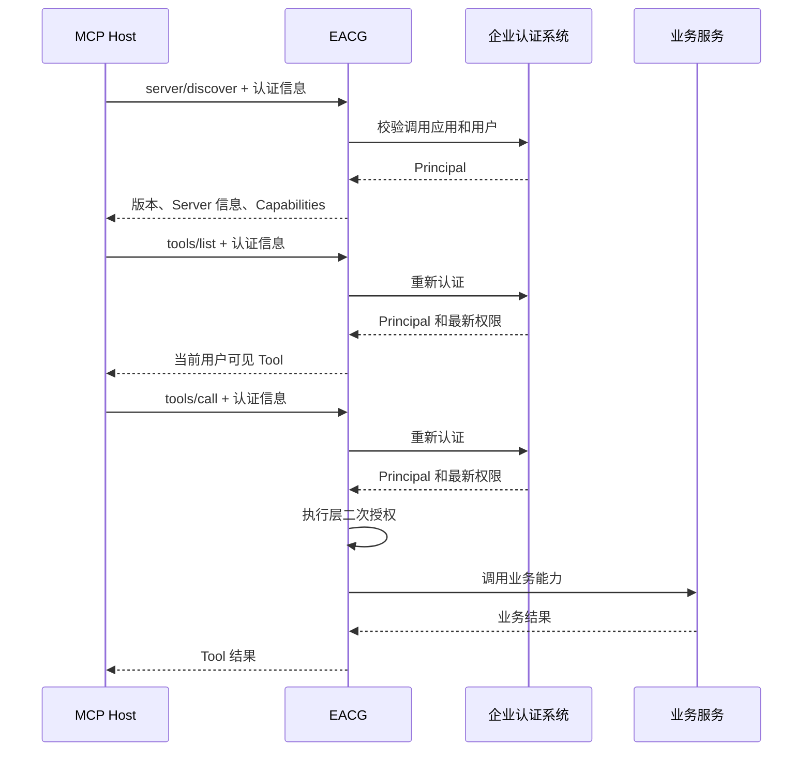

# MCP 2026-07-28 工作流程入门

## 1. 先用 HTTP 理解 MCP

MCP 是运行在 HTTP 之上的应用协议：

```text
HTTP 负责：连接、Header、Body、状态码
JSON-RPC 负责：请求编号、方法名、参数、结果和错误
MCP 负责：Tool 发现、Tool 调用和双方能力描述
EACG 负责：企业认证、授权、执行和审计
```

TCP 建立连接是传输层行为。新版 MCP 不再建立额外的服务器端协议会话，每个 HTTP 请求都是完整、独立的业务请求。

## 2. 一次请求包含什么

HTTP Header 描述协议版本和路由信息：

```http
Mcp-Protocol-Version: 2026-07-28
Mcp-Method: tools/call
Mcp-Name: get_profile
```

JSON Body 描述 JSON-RPC 调用：

```json
{
  "jsonrpc": "2.0",
  "id": 3,
  "method": "tools/call",
  "params": {
    "_meta": {
      "io.modelcontextprotocol/protocolVersion": "2026-07-28",
      "io.modelcontextprotocol/clientCapabilities": {},
      "io.modelcontextprotocol/clientInfo": {
        "name": "curl-client",
        "version": "1.0.0"
      }
    },
    "name": "get_profile",
    "arguments": {
      "user_id": "user-1001"
    }
  }
}
```

Header 和 Body 中的方法、名称、版本必须一致。EACG 会拒绝不一致的请求。

## 3. Client 或 Host 的调用时序



`server/discover` 可以由 MCP SDK 自动完成。它不是登录操作，也不会生成后续请求需要保存的标识。

## 4. 为什么每次都要认证

无状态不等于无认证。它表示服务器不依赖上一条请求的内存状态。

每次请求重新认证可以保证：

- API Key 被吊销后立即失效；
- 服务权限变化后下一次请求立即生效；
- 自定义用户认证中的停用和角色变化立即生效；
- 任意实例都能处理下一条请求；
- 不需要粘滞负载均衡。

内置 API Key 认证证明“哪个应用在调用”，直接生成服务 Principal，不要求 requester userid。企业微信等代理用户场景由业务自定义 Authenticator 校验 userid，再返回用户 Principal。

## 5. 响应格式

EACG 的普通请求返回：

```http
Content-Type: application/json
```

完成结果包含：

```json
{
  "jsonrpc": "2.0",
  "id": 3,
  "result": {
    "resultType": "complete"
  }
}
```

如果未来启用 `subscriptions/listen`，该长连接会使用 `text/event-stream`。这是新版 Streamable HTTP 的流式响应，不是独立的旧传输端点。

## 6. 常见错误

| 场景 | HTTP / JSON-RPC |
| --- | --- |
| 凭据缺失或无效 | `401` |
| Origin 不可信 | `403` |
| 请求方法不是 POST | `405` |
| 协议版本不支持 | `400 / -32022` |
| Header 与 Body 不一致 | `400 / -32020` |
| JSON-RPC 方法不存在 | `-32601` |
| Tool 不存在或无权调用 | 安全 Tool Error |

## 7. 开发检查清单

- 每次请求携带认证 Header；
- 每次请求携带协议 Header 和 `_meta`；
- Tool 调用同时携带 `Mcp-Name`；
- 租户和用户只从 `Principal` 获取；
- Tool 参数中不允许传入租户身份；
- Client 不能依赖服务器保存上一条请求的状态。

## 8. 使用 Go Client 观察流程

仓库提供 `cmd/eacg-client`：

```bash
# 先启动 Server
make run

# 在另一个终端运行 Client
make client
```

Client 使用官方 SDK，但会输出脱敏后的真实请求和响应。SDK 的 `Connect` 自动执行 `server/discover`，随后示例继续执行 `tools/list` 和 `tools/call`。

详细代码说明见 [EACG MCP Client 示例说明](EACG_MCP客户端示例说明.md)。
